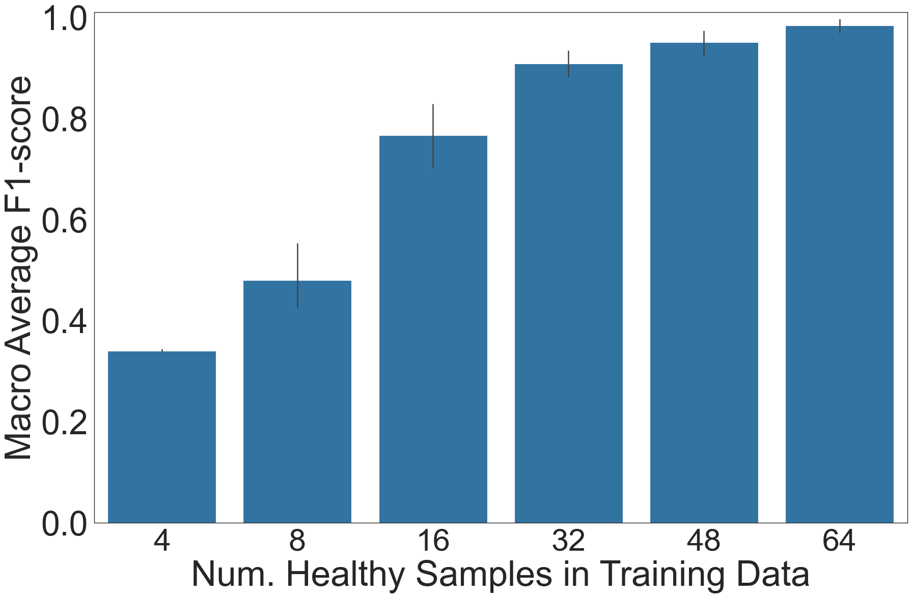

**Changes from Tensorflow -> PyTorch (and Python 3.6 -> Python 3.9):**
- only modified `anomaly_detector.py` and `vae.py`
- in `vae.py`:
    - complete rewrite to PyTorch, but maintains same signatures and function names
    - saves model to pytorch-style state_dict
    - also incorporates some explicit typing (not available in Python 3.6, but this is option and can be reverted without damage)
- in `anomaly_detector.py`:
    - loading model from file now uses pytorch-style load_state_dict
    - removed some unused and unnecessary functions:
        - `calculate_reconstruction_error` seemed to be duplicated from vae.py
        - `_predict_anomaly` can be replaced with functions defined in vae.py, without harm

**Changes in data:**
- because Python 3.9 does not support `matrixprofile` features in tsfresh, I manually remove exactly 50 features from the pre-selected feature file that come from `matrixprofile`
    - new file is called `fe_eclipse_tsfresh_raw_CHI_2000_clean.json`
- also include jupyter notebook used to remove features, but this can safely be deleted as well

**Reproducibility Results**:
- results are generally as expected: as seen from graph below:

- at 64 healthy samples, though, F1 is 1.0, which is suspicious contrasting with the published results of around 0.96 F1 at 64 samples
    - maybe PyTorch is implicitly doing something better than TensorFlow?
    - another possible reason is my adjustment to `reparameterize()` in `vae.py`, where I reduce the randomness injected into the VAE to stabilize the results (which was useful in Praxium)

- full experiment (10 trials as outlined in Prodigy README) ran in 2565.07s (around 30 minutes) on my MacBook (M3 Pro)